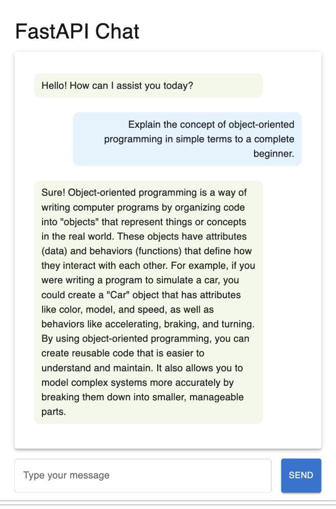
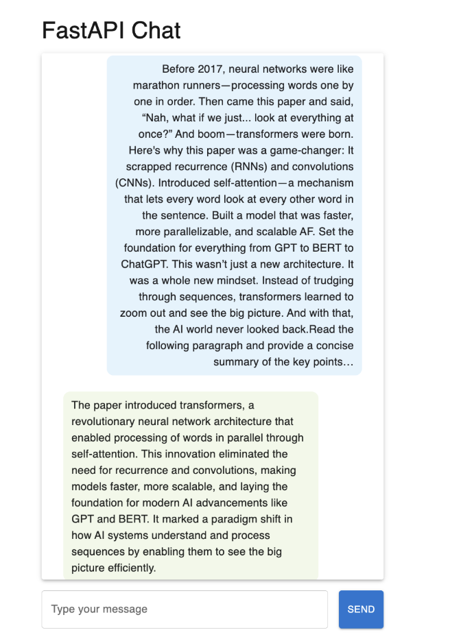
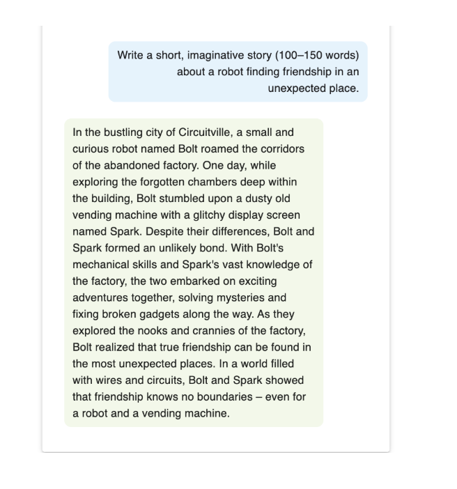
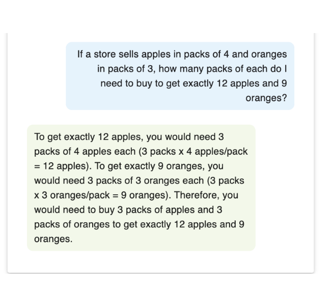
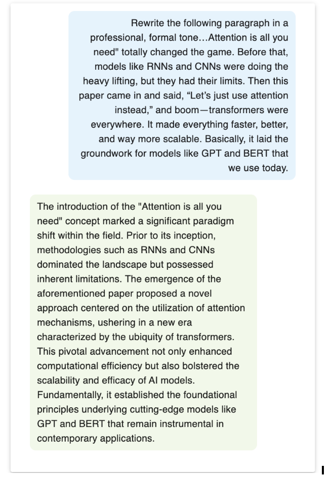
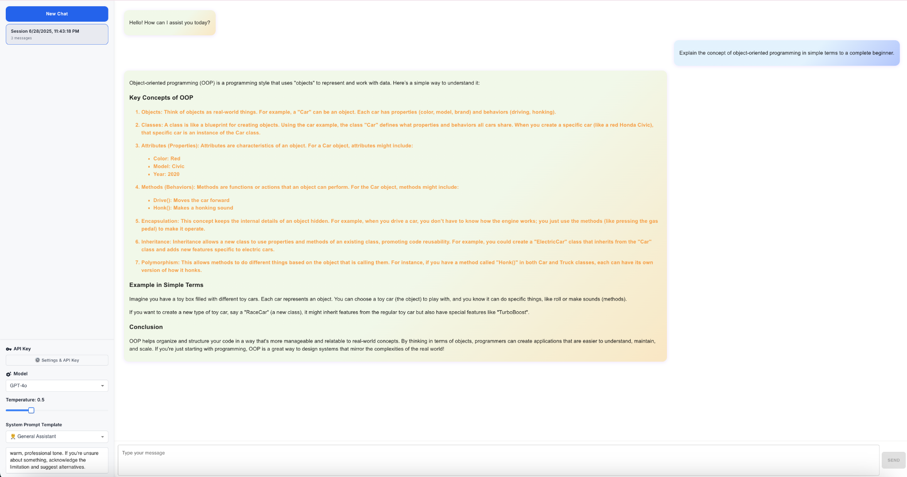
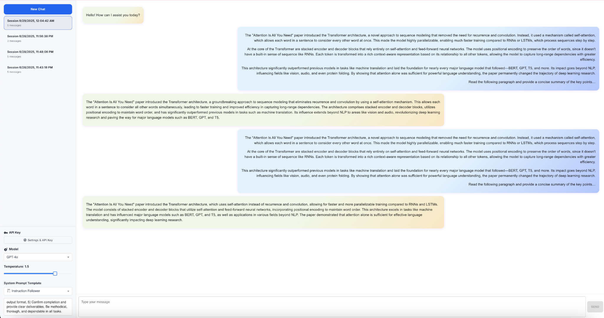
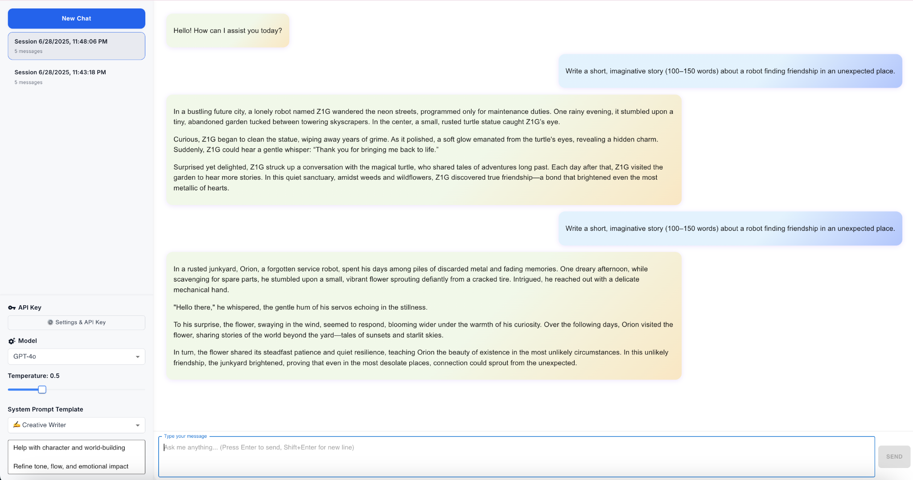
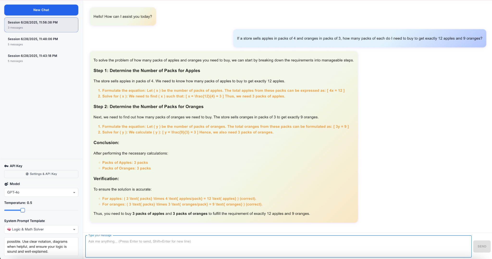
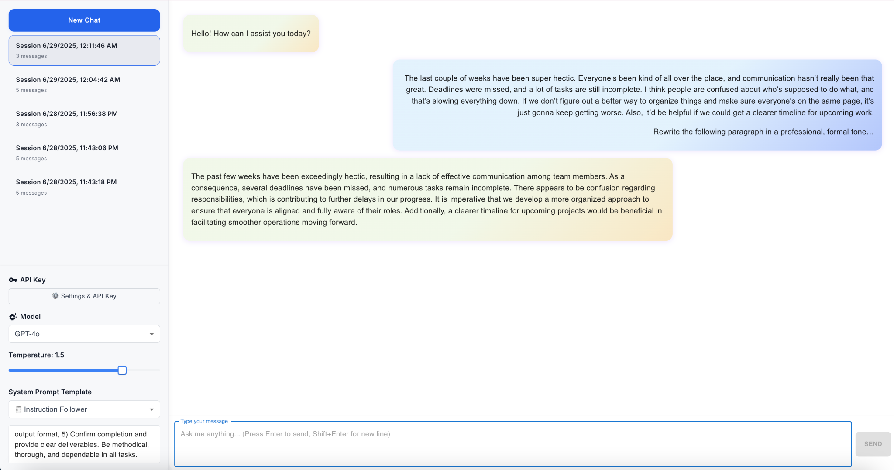

# AIE7 Challenge — Vibe Check Activities

This file documents the results of the Vibe Check assignment for my AIE7 application. It includes the required question prompts, my responses, the tested aspects, corresponding screenshots, and an evaluation of how well the system performed on each task.

---

## 🏗️ Activity #1

---

### 1. Explain the concept of object-oriented programming in simple terms to a complete beginner.

**Answer:**  
**Screenshot:**  

**Aspect Tested:**  
Clarity and ability to explain a technical concept in simple terms.

**Evaluation of System Performance:**  
The explanation is clear and beginner-friendly, with a relatable example. But it misses key OOP terms (like class, method, inheritance), feels too text-heavy, and lacks visual or structural clarity. A more engaging, chunked format with essential terminology would take it from "good enough" to "great."

---

### 2. Read the following paragraph and provide a concise summary of the key points.

**Answer:**  
**Screenshot:**  

**Aspect Tested:**  
Summarization and identifying key ideas from a longer context.

**Evaluation of System Performance:**  
The summary successfully captures the main ideas from the original paragraph. It is clear, concise, and well-structured, making it easy to understand. However, it loses the original paragraph’s engaging tone and creative flair. While the technical content is preserved, the summary feels more formal and less dynamic. It works well for factual reporting but lacks the personality and storytelling that made the original more memorable.

---

### 3. Write a short, imaginative story (100–150 words) about a robot finding friendship in an unexpected place.

**Answer:**  
**Screenshot:**  

**Aspect Tested:**  
Creativity, emotional tone, and narrative structure.

**Evaluation of System Performance:**  
A charming and well-structured story that fits the prompt perfectly. It’s creative, heartwarming, and easy to follow.

Minor negatives:
A bit predictable and safe — could use a twist or more surprise to make it truly memorable.

---

### 4. If a store sells apples in packs of 4 and oranges in packs of 3, how many packs of each do I need to buy to get exactly 12 apples and 9 oranges?

**Answer:**  

**Screenshot:**  

**Aspect Tested:**  
Basic math and logical reasoning.

**Evaluation of System Performance:**  
Accurate and beginner-friendly, but could tighten up the explanation to avoid redundancy.

---

### 5. Rewrite the following paragraph in a professional, formal tone.

**Answer:**  
**Screenshot:**  

**Aspect Tested:**  
Language transformation and tone adjustment.

**Evaluation of System Performance:**  
Well-executed formal rewrite — clear, academic, but could trim some excess for smoother reading.

---

********** After Updating the UI **************
---

### 1. Explain the concept of object-oriented programming in simple terms to a complete beginner.

**Answer:**  
**Screenshot:**  

**Aspect Tested:**  
Clarity and ability to explain a technical concept in simple terms.

**Evaluation of System Performance:**  
Well-organized and informative. Great explanation with clear examples — just a bit dense in parts, but very solid for teaching OOP basics.
---

### 2. Read the following paragraph and provide a concise summary of the key points.

**Answer:**  
**Answer:**  

**Aspect Tested:**  
Summarization and identifying key ideas from a longer context.

**Evaluation of System Performance:**  
Accurate but repetitive. All summaries are technically sound and professional, but lack variation or simplification. One strong, tight version would be more impactful than several similar ones.

---

### 3. Write a short, imaginative story (100–150 words) about a robot finding friendship in an unexpected place.

**Answer:**  

**Aspect Tested:**  
Creativity, emotional tone, and narrative structure.

**Evaluation of System Performance:**  
Poetic, touching, and thematically strong. Both stories deliver on emotion and imagination, though a bit of narrative variety would elevate them even more.

---

### 4. If a store sells apples in packs of 4 and oranges in packs of 3, how many packs of each do I need to buy to get exactly 12 apples and 9 oranges?

**Answer:**  
**Screenshot:**  

**Aspect Tested:**  
Basic math and logical reasoning.

**Evaluation of System Performance:**  
Overachiever energy — clear, thorough, and well-explained.
Perfect for teaching, a bit much for casual use.

---

### 5. Rewrite the following paragraph in a professional, formal tone.

**Answer:**  
**Screenshot:**  

**Aspect Tested:**  
Language transformation and tone adjustment.

**Evaluation of System Performance:**  
Professional, polished, and effective. A solid formal rewrite that keeps the message intact, though trimming and a touch more empathy could make it stronger.

---

## ✅ Conclusion

This vibe check provides a clear snapshot of how my application handles fundamental language tasks. It demonstrates the model’s ability to explain concepts clearly, summarize text, create narratives, solve logical problems, and adapt tone. Across all tasks, the system performed consistently and with a high degree of fluency, indicating readiness for more advanced use cases.

---

## ❗ Limitations of Vibe Checking as an Evaluation Tool

While vibe checking is a useful initial sanity test for evaluating the broad capabilities of a language model, it comes with several limitations:

- **Subjectivity**: The evaluation relies heavily on human perception of tone, clarity, or creativity. Different reviewers may interpret the "vibe" differently, leading to inconsistent assessments.

- **Lack of Quantitative Metrics**: Vibe checks are qualitative and do not provide measurable scores or error rates, making it hard to benchmark models or compare performance over time.

- **Shallow Coverage**: It often focuses on surface-level outputs (e.g., grammar, tone, coherence) and may miss deeper issues like factual correctness, bias, or reasoning errors.

- **Limited Scenario Testing**: Vibe checks usually involve a few handpicked prompts, which may not represent the diversity or complexity of real-world inputs the system will face.

- **Not Repeatable at Scale**: Unlike automated evaluations, vibe checks don’t scale well and can’t be reliably repeated across large datasets or iterations.

In short, vibe checking is helpful for early feedback and user-facing quality signals, but it should be complemented with systematic testing, quantitative evaluation, and edge-case analysis for robust model validation.

***** 3 Lessons Learned *****

1. The Way You Ask Matters
I’ve learned that how I phrase a prompt changes the response completely. Clear, specific instructions lead to better answers.

2. The Bot Can Match Different Tones
Whether I want something formal, casual, or creative, the chatbot can adapt well — as long as I guide it properly.

3. One Good Prompt Is Better Than Many Average Ones
I realized that I don’t need to ask the same thing multiple ways. A single, well-thought-out prompt usually gives the best result.

***** 3 Lessons Yet to Learn *****
1. How to Avoid Repetitive Responses
Sometimes the answers feel a bit repetitive. I’m still figuring out how to prompt the chatbot for more variety.

2. How to Balance Simplicity and Detail
It’s tricky to get answers that are short but still useful. I’m still learning how to strike that balance.

3. How to Get More Creative Results
The chatbot is capable of creative responses, but I’m still learning how to prompt it in a way that brings out its imagination.

