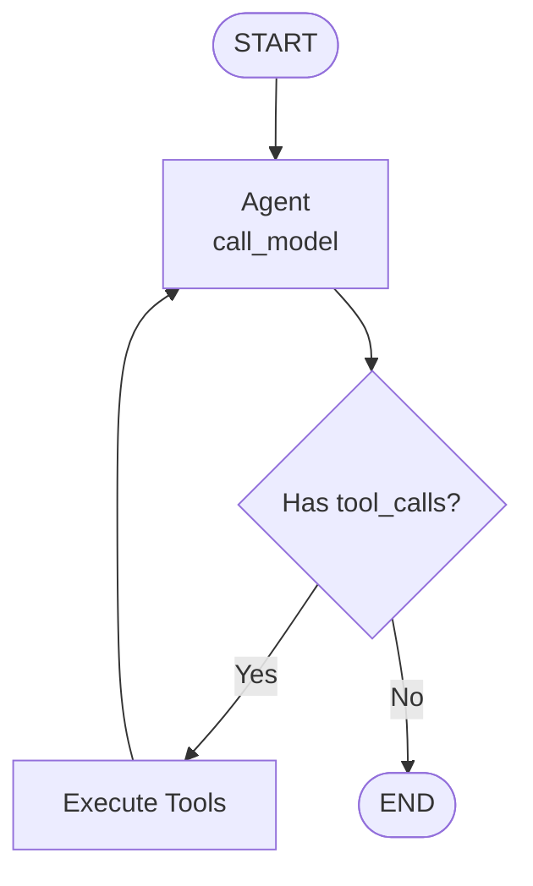
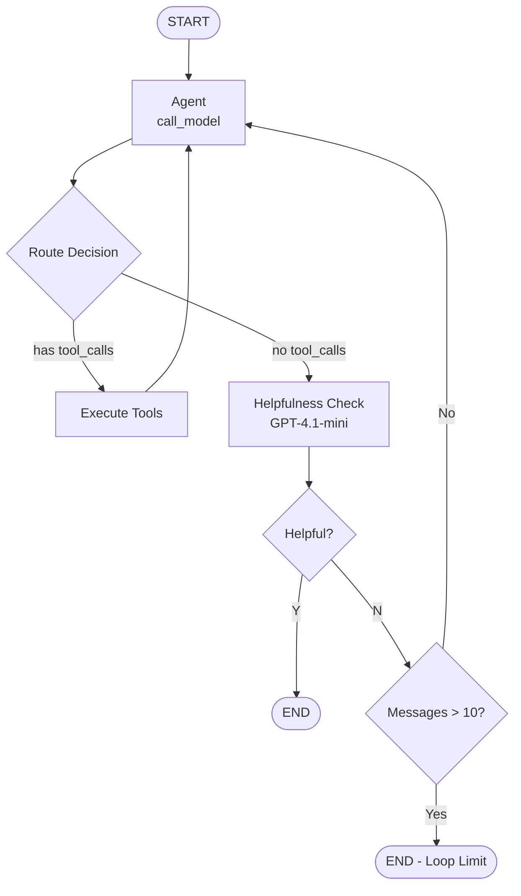

# LangGraph Session 14 - Solutions Document

## Question 1: 
What is the purpose of the `chunk_overlap` parameter when using `RecursiveCharacterTextSplitter` to prepare documents for RAG, and what trade-offs arise as you increase or decrease its value?

### RAG Pipeline Context

Typical RAG pipelines process documents through these stages:
1. **Load Documents** from data sources using document loaders
2. **Split Text** into manageable chunks using text splitters
3. **Create Embeddings** using embedding models
4. **Store Vectors** in vector databases
5. **Retrieve** similar chunks for queries
6. **Generate Response** using language models with retrieved context

### Purpose of `chunk_overlap`
The `chunk_overlap` parameter defines how many tokens/characters from the end of one chunk are repeated at the beginning of the next chunk. This creates overlapping segments of text between consecutive chunks.

### Trade-offs of Different Values

#### **chunk_overlap = 0 (No Overlap)**
**Advantages:**
- Maximum storage efficiency (no duplicate content)
- Faster processing (less data to embed and store)
- Lower computational costs
- Clear boundaries between chunks

**Disadvantages:**
- Risk of losing context at chunk boundaries
- Important information spanning two chunks may be split
- Reduced semantic coherence for cross-boundary concepts
- May miss relevant content if the query relates to information at chunk edges

#### **Increasing chunk_overlap (e.g., 50-200 tokens)**
**Advantages:**
- Preserves context across chunk boundaries
- Better semantic continuity
- Higher chance of retrieving complete information
- Improved handling of concepts that span multiple chunks
- Better for complex documents with interconnected ideas

**Disadvantages:**
- Increased storage requirements (duplicate content)
- Higher embedding costs (more tokens to process)
- Potential for retrieving redundant information
- Slower indexing and retrieval
- May introduce noise in similarity matching

### Recommended Values
- **For structured documents:** 50-100 tokens overlap
  - Documents with interconnected sections and cross-references
- **For technical documentation:** 100-150 tokens overlap
  - Code examples and explanations often span boundaries
- **For narrative content:** 25-50 tokens overlap
  - Natural paragraph breaks usually align well with chunks

---

## Question 2: Your retriever is configured with `search_kwargs={"k": 5}`. How would adjusting `k` likely affect RAGAS metrics such as Context Precision and Context Recall in practice, and why?

### Understanding the `k` Parameter
The `k` parameter determines how many chunks the retriever returns for each query. Most vector databases use a default value (commonly k=4 or k=5) when not explicitly specified.

### How `k` Parameter Affects RAG Performance

#### **Context Quality vs Quantity Trade-off**

**Lower k (e.g., k=2-3):**
- ✅ **Focused Context**: Less irrelevant information for the LLM to process
- ✅ **Faster Processing**: Reduced token usage and processing time
- ✅ **Higher Signal-to-Noise Ratio**: Each retrieved chunk more likely to be relevant
- ❌ **Missing Information Risk**: May not capture all aspects of complex queries
- ❌ **Incomplete Coverage**: Multi-faceted questions might lack comprehensive context

**Higher k (e.g., k=8-10):**
- ✅ **Comprehensive Coverage**: Better chance of including all relevant information
- ✅ **Multi-faceted Queries**: Handles complex questions requiring diverse context
- ✅ **Redundancy Benefits**: Multiple chunks can reinforce key concepts
- ❌ **Information Overload**: Too much context can confuse the LLM
- ❌ **Increased Costs**: More tokens processed = higher API costs
- ❌ **Context Window Limits**: Risk of exceeding model's context limits

### Impact on RAGAS Evaluation Metrics

#### **RAGAS Context Precision**
*Definition: Measures the proportion of relevant chunks in retrieved context*

**k Parameter Impact:**
- **Lower k**: Higher Context Precision scores if retrieval is accurate (fewer irrelevant chunks dilute the score)
- **Higher k**: Lower Context Precision scores due to inclusion of marginally relevant chunks
- **Sweet Spot**: k=4-6 typically balances relevance with coverage

#### **RAGAS Context Recall** 
*Definition: Measures how many claims in the reference answer can be supported by retrieved context*

**k Parameter Impact:**
- **Lower k**: Risk of lower Context Recall if key supporting information is missed
- **Higher k**: Better Context Recall scores as more supporting evidence is retrieved
- **Trade-off**: Need sufficient k to support all claims without overwhelming with irrelevant content

### Practical k Selection Strategy

#### **Step 1: Baseline Testing**
```python
# Test different k values
k_values = [2, 3, 4, 5, 6, 8, 10]
retriever = qdrant_vectorstore.as_retriever(search_kwargs={"k": k})
```

#### **Step 2: Performance Monitoring**
1. **Monitor Answer Quality**: Track response accuracy and completeness
2. **Measure Processing Time**: Higher k = slower responses
3. **Watch Token Usage**: Higher k = increased costs
4. **Evaluate RAGAS Scores**: Balance Context Precision and Context Recall

#### **Step 3: Domain-Specific Optimization**
- **Structured Documents**: k=4-5
  - Complex content often requires multiple supporting chunks
  - But too many chunks can introduce contradictory information
- **Technical Documentation**: k=6-8  
  - Code examples and explanations often span multiple sections
- **FAQ/Simple Queries**: k=2-3
  - Direct answers don't need extensive context

#### **Step 4: Adaptive k Selection**
```python
# Dynamic k based on query complexity
def adaptive_k_selection(query: str) -> int:
    if len(query.split()) < 5:  # Simple query
        return 3
    elif "how" in query.lower() or "explain" in query.lower():  # Complex query
        return 6
    else:  # Standard query
        return 4
```

### Implementation Recommendations

1. **Start with k=4** (balanced baseline)
2. **A/B test different k values** with your specific dataset and use case
3. **Monitor both quality metrics and performance**:
   - Response accuracy
   - Processing latency  
   - Token costs
   - User satisfaction
4. **Consider query-adaptive k selection** for optimal performance

---

## Question 3: Compare the `agent` and `agent_helpful` assistants defined in `langgraph.json`. Where does the helpfulness evaluator fit in the graph, and under what condition should execution route back to the agent vs. terminate?

### Architecture Comparison

#### **Simple Agent (`app/graphs/simple_agent.py`)**



**Flow:**
1. Agent receives messages
2. Calls model with tools
3. If tool calls needed → execute tools → return to agent
4. If no tool calls → END

**Characteristics:**
- Direct, efficient execution
- No evaluation of response quality
- Terminates after generating response
- Suitable for straightforward queries

#### **Agent with Helpfulness (`app/graphs/agent_with_helpfulness.py`)**



**Flow:**
1. Agent receives messages
2. Calls model with tools
3. If tool calls → execute → return to agent
4. If no tool calls → helpfulness evaluation
5. Helpfulness node evaluates response quality
6. If helpful (Y) → END
7. If not helpful (N) → check loop limit
8. If under 10 messages → loop back to agent
9. If over 10 messages → forced termination

### Helpfulness Evaluator Details

**Location in Graph:**
- Added as a separate node after agent response
- Positioned between agent and termination

**Evaluation Process (lines 43-76):**
1. Takes initial query and final response
2. Uses GPT-4.1-mini to evaluate helpfulness
3. Returns 'Y' for helpful, 'N' for unhelpful
4. Decision is added as AIMessage with "HELPFULNESS:Y/N"

### Routing Conditions

**Route Back to Agent:**
- When helpfulness evaluation returns 'N'
- Response deemed insufficient for user query
- Allows agent to retry with accumulated context
- Maximum 10 messages before forced termination

**Terminate Execution:**
- When helpfulness evaluation returns 'Y'
- When message limit (10) is exceeded
- When "HELPFULNESS:END" marker is present

### Use Case Recommendations

**Use Simple Agent for:**
- Well-defined, straightforward queries
- Time-sensitive responses
- High-confidence tool usage
- Cost optimization (fewer LLM calls)

**Use Agent with Helpfulness for:**
- Complex, nuanced queries
- Critical accuracy requirements
- Domain-specific guidance requiring precision
- Situations requiring quality assurance
- User-facing applications where response quality matters

### Key Differences Summary

| Aspect | Simple Agent | Agent with Helpfulness |
|--------|-------------|----------------------|
| **Complexity** | Minimal, 2 nodes | Complex, 3 nodes + evaluation |
| **Response Quality** | No validation | Quality checked |
| **Execution Time** | Fast | Slower (evaluation overhead) |
| **Cost** | Lower | Higher (additional LLM calls) |
| **Reliability** | Basic | Enhanced with retry mechanism |
| **Loop Protection** | None needed | 10-message limit |
| **Best For** | Simple queries | Critical/complex queries |

---

## General Implementation Guidelines

### Parameter Optimization Strategy:

1. **Choose appropriate agent type** based on:
   - Query complexity and criticality
   - Required response accuracy
   - Performance vs quality trade-offs
   - Cost constraints

2. **Optimize chunk_overlap** by considering:
   - Document structure and interconnectedness
   - Balance between context preservation and efficiency
   - Domain-specific content patterns

3. **Configure retriever k value** based on:
   - Query complexity and scope
   - Available context window size
   - Performance requirements
   - Cost considerations

4. **Continuous Monitoring:**
   - Track system performance metrics
   - Measure response quality and user satisfaction
   - Analyze retrieval and generation effectiveness
   - Adjust parameters based on real-world feedback

### Implementation Examples:

1. **Dynamic k configuration:**
```python
# Adaptive k based on query characteristics
k_value = adaptive_k_selection(query)
retriever = vectorstore.as_retriever(search_kwargs={"k": k_value})
```

2. **Flexible chunk_overlap:**
```python
# Percentage-based overlap for consistency
chunk_overlap = int(chunk_size * 0.1)  # 10% overlap
```

3. **Performance monitoring:**
```python
# Track system performance metrics
logger.info(f"Retrieval metrics: precision={precision}, recall={recall}")
logger.info(f"Response quality: {quality_score}")
```