<p align = "center" draggable="false" >
</p>

## <h1 align="center" id="heading">Session 15: Build & Serve an A2A Endpoint for Our LangGraph Agent</h1>

| 🤓 Pre-work | 📰 Session Sheet | ⏺️ Recording     | 🖼️ Slides        | 👨‍💻 Repo         | 📝 Homework      | 📁 Feedback       |
|:-----------------|:-----------------|:-----------------|:-----------------|:-----------------|:-----------------|:-----------------|
| [Session 15: Pre-Work](https://www.notion.so/Session-15-Agent2Agent-Protocol-Agent-Ops-247cd547af3d8066bc5be493bc0c7eda?source=copy_link#247cd547af3d81369191e4e6cd62f875)| [Session 15: Agent2Agent Protocol & Agent Ops](https://www.notion.so/Session-15-Agent2Agent-Protocol-Agent-Ops-247cd547af3d8066bc5be493bc0c7eda) | [Recording!](https://us02web.zoom.us/rec/share/lgZHp8jqB5D5ytsi1gKH-wwdoz6fX0yBlJFOz5tuoGa1TMU0x7e9rKkkH4a75uUx.RC9C31cDG5Bl4UR2) (mttc.$6G)| [Session 15 Slides](https://www.canva.com/design/DAGv5Xxl3Vw/CRpCrhpika6yPjcQHwB_MQ/edit?utm_content=DAGv5Xxl3Vw&utm_campaign=designshare&utm_medium=link2&utm_source=sharebutton) | You are here! | [Session 15 Assignment: A2A](https://forms.gle/RPC6sNh2WXE6984j9) | [AIE7 Feedback 8/12](https://forms.gle/AZT2usWxqzfa1JNc8)

# A2A Protocol Implementation with LangGraph

This session focuses on implementing the **A2A (Agent-to-Agent) Protocol** using LangGraph, featuring intelligent helpfulness evaluation and multi-turn conversation capabilities.

## 🎯 Learning Objectives

By the end of this session, you'll understand:

- **🔄 A2A Protocol**: How agents communicate and evaluate response quality

## 🧠 A2A Protocol with Helpfulness Loop

The core learning focus is this intelligent evaluation cycle:

```mermaid
graph TD
    A["👤 User Query"] --> B["🤖 Agent Node<br/>(LLM + Tools)"]
    B --> C{"🔍 Tool Calls<br/>Needed?"}
    C -->|"Yes"| D["⚡ Action Node<br/>(Tool Execution)"]
    C -->|"No"| E["🎯 Helpfulness Node<br/>(A2A Evaluation)"]
    D --> F["🔧 Execute Tools"]
    F --> G["📊 Tavily Search<br/>(Web Results)"]
    F --> H["📚 ArXiv Search<br/>(Academic Papers)"]  
    F --> I["📄 RAG Retrieval<br/>(Document Search)"]
    G --> B
    H --> B
    I --> B
    E --> J{"✅ Is Response<br/>Helpful?"}
    J -->|"Yes (Y)"| K["🏁 END<br/>(Task Complete)"]
    J -->|"No (N)"| L{"🔄 Loop Count<br/>< 10?"}
    L -->|"Yes"| B
    L -->|"No"| K
    
    style A fill:#1e3a5f,stroke:#ffffff,stroke-width:3px,color:#ffffff
    style B fill:#4a148c,stroke:#ffffff,stroke-width:3px,color:#ffffff
    style C fill:#0d47a1,stroke:#ffffff,stroke-width:3px,color:#ffffff
    style D fill:#1b5e20,stroke:#ffffff,stroke-width:3px,color:#ffffff
    style E fill:#e65100,stroke:#ffffff,stroke-width:3px,color:#ffffff
    style F fill:#2e7d32,stroke:#ffffff,stroke-width:3px,color:#ffffff
    style G fill:#00695c,stroke:#ffffff,stroke-width:3px,color:#ffffff
    style H fill:#4527a0,stroke:#ffffff,stroke-width:3px,color:#ffffff
    style I fill:#283593,stroke:#ffffff,stroke-width:3px,color:#ffffff
    style J fill:#2e7d32,stroke:#ffffff,stroke-width:3px,color:#ffffff
    style K fill:#c62828,stroke:#ffffff,stroke-width:3px,color:#ffffff
    style L fill:#f57c00,stroke:#ffffff,stroke-width:3px,color:#ffffff
```



# Build 🏗️

Complete the following tasks to understand A2A protocol implementation:

## 🚀 Quick Start

```bash
# Setup and run
./quickstart.sh
```

```bash
# Start LangGraph server
uv run python -m app
```

```bash
# Test the A2A Serer
uv run python app/test_client.py
```

### 🏗️ Activity #1:

Build a LangGraph Graph to "use" your application.

Do this by creating a Simple Agent that can make API calls to the 🤖Agent Node above through the A2A protocol. 

### ❓ Question #1:

What are the core components of an `AgentCard`?

**Answer:**

An **AgentCard** is a Python data structure (class) from the A2A SDK that defines an agent's identity and capabilities. It acts as a standardized way to describe what an agent can do and how other agents can interact with it.

**Core Components:**

1. **Identity Information**
   - `name`: Human-readable agent identifier 
   - `description`: Brief explanation of agent capabilities
   - `version`: Version number for compatibility
   - `url`: Base URL where agent is accessible

2. **Input/Output Modes**
   - `default_input_modes`: Supported input content types
   - `default_output_modes`: Supported output content types

3. **Agent Capabilities**
   - `capabilities`: AgentCapabilities object defining features like:
     - `streaming`: Whether agent supports streaming responses
     - `push_notifications`: Whether agent can send push notifications

4. **Skills Array**
   - `skills`: List of AgentSkill objects, each containing:
     - `id`: Unique skill identifier
     - `name`: Skill display name
     - `description`: What the skill does
     - `tags`: Categorization labels for discovery
     - `examples`: Sample usage patterns

**Example:**
```python
agent_card = AgentCard(
    name='General Purpose Agent',
    description='A helpful AI assistant with web search, academic paper search, and document retrieval capabilities',
    url='http://localhost:10000/',
    version='1.0.0',
    default_input_modes=['text', 'text/plain'],
    default_output_modes=['text', 'text/plain'],
    capabilities=AgentCapabilities(streaming=True, push_notifications=True),
    skills=[
        AgentSkill(
            id='web_search',
            name='Web Search Tool',
            description='Search the web for current information',
            tags=['search', 'web', 'internet'],
            examples=['What are the latest news about AI?']
        )
    ]
)
```

**Purpose:**
The AgentCard enables agent discovery and communication in A2A protocol. When agents need to interact, they can query each other's AgentCards to understand available capabilities, ensuring proper routing and compatibility in distributed agent systems.

### ❓ Question #2:

Why is A2A (and other such protocols) important in your own words?

**Answer:**

A2A (Agent-to-Agent) protocols are crucial for building scalable and interoperable AI systems. Here's why they matter:

**1. Standardized Communication**
A2A protocols establish a common language that allows different AI agents to communicate seamlessly, regardless of their underlying implementation frameworks (LangGraph, CrewAI, AutoGen, etc.). This prevents vendor lock-in and promotes ecosystem diversity.

**2. Agent Specialization & Composition** 
Instead of building monolithic "do-everything" agents, A2A protocols enable creating specialized agents that excel at specific tasks (web search, document analysis, code generation) and then composing them together. This modular approach leads to better performance and easier maintenance.

**3. Dynamic Discovery & Routing**
Through standardized AgentCards, agents can dynamically discover each other's capabilities and route requests to the most appropriate specialist. This creates flexible, self-organizing agent networks that can adapt to new requirements without manual reconfiguration.

**4. Scalability & Load Distribution**
A2A protocols enable horizontal scaling by distributing workloads across multiple agent instances. When one agent is overloaded, requests can be automatically routed to available alternatives, ensuring system resilience.

**5. Innovation Acceleration**
By standardizing the integration layer, developers can focus on building specialized capabilities rather than custom integration code. This accelerates innovation as new agents can immediately integrate with existing ecosystems.

**Practical Example:**
Consider a research task: "Analyze recent AI trends and write a comprehensive report." Without A2A protocols, you'd need one massive agent handling web search, academic paper retrieval, document analysis, and writing. With A2A protocols, you can orchestrate specialized agents: a web search agent finds current news, an academic agent retrieves papers from arXiv, a document agent analyzes content, and a writing agent compiles the final report - all working together seamlessly.

**Real-World Impact:**
Just as HTTP enabled the web by standardizing how websites communicate, A2A protocols are enabling an "agent web" where AI capabilities can be discovered, composed, and scaled dynamically. This is essential for the future of AI where complex tasks will require coordination between multiple specialized agents rather than relying on single, monolithic models.

### 🚧 Advanced Build:

<details>
<summary>🚧 Advanced Build 🚧 (OPTIONAL - <i>open this section for the requirements</i>)</summary>

Use a different Agent Framework to **test** your application.

Do this by creating a Simple Agent that acts as different personas with different goals and have that Agent use your Agent through A2A. 

Example:

"You are an expert in Machine Learning, and you want to learn about what makes Kimi K2 so incredible. You are not satisfied with surface level answers, and you wish to have sources you can read to verify information."
</details>

## 📁 Implementation Details

For detailed technical documentation, file structure, and implementation guides, see:

**➡️ [app/README.md](./app/README.md)**

This contains:
- Complete file structure breakdown
- Technical implementation details
- Tool configuration guides
- Troubleshooting instructions
- Advanced customization options

# Ship 🚢

- Short demo showing running Client

# Share 🚀

- Explain the A2A protocol implementation
- Share 3 lessons learned about agent evaluation
- Discuss 3 lessons not learned (areas for improvement)

# Submitting Your Homework

## Main Homework Assignment

Follow these steps to prepare and submit your homework assignment:
1. Create a branch of your `AIE7` repo to track your changes. Example command: `git checkout -b s15-assignment`
2. Complete the activity above
3. Answer the questions above _in-line in this README.md file_
4. Record a Loom video reviewing the changes you made for this assignment and your comparison of the flows (Breakout Room Part #2 - Task 3).
5. Commit, and push your changes to your `origin` repository. _NOTE: Do not merge it into your main branch._
6. Make sure to include all of the following on your Homework Submission Form:
    + The GitHub URL to the `15_A2A_LANGGRAPH` folder _on your assignment branch (not main)_
    + The URL to your Loom Video
    + Your Three lessons learned/not yet learned
    + The URLs to any social media posts (LinkedIn, X, Discord, etc.) ⬅️ _easy Extra Credit points!_

### OPTIONAL: Advanced Build Assignment _(Can be done in lieu of the Main Homework Assignnment)_

Follow these steps to prepare and submit your homework assignment:
1. Create a branch of your `AIE7` repo to track your changes. Example command: `git checkout -b s015-assignment`
2. Complete the requirements for the Advanced Build
3. Record a Loom video reviewing the agent you built and demostrating in action
4. Commit, and push your changes to your `origin` repository. _NOTE: Do not merge it into your main branch._
5. Make sure to include all of the following on your Homework Submission Form:
    + The GitHub URL to the `15_A2A_LANGGRAPH` folder _on your assignment branch (not main)_
    + The URL to your Loom Video
    + Your Three lessons learned/not yet learned
    + The URLs to any social media posts (LinkedIn, X, Discord, etc.) ⬅️ _easy Extra Credit points!_
=======
