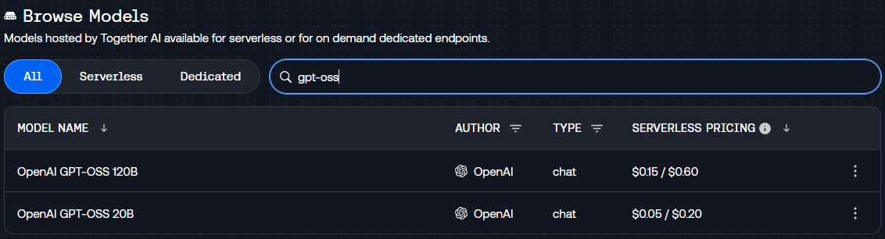
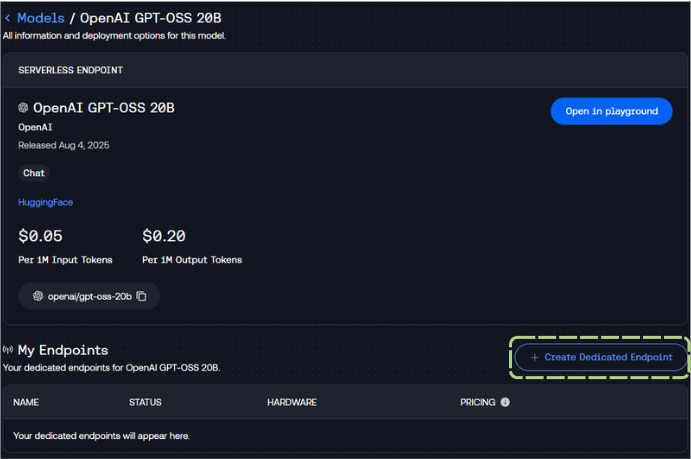

# Setting Up Your Open-Source Endpoint

> NOTE: If you do not wish to purchase $50 of compute credits for T2 (for using dedicated endpoints) you can instead skip the following set-up and simply use the serverless endpoints offered at: 

- `openai/gpt-oss-20b`

## Your Generator

First, you'll want to navigate to [api.together.ai/models](https://api.together.ai/models), and search for the model we'll be using today: 

- `gpt-oss`

We're going to select the OpenAI GPT-OSS 20B model by clicking on it:



Next, we're going to click on "Create Dedicated Endpoint" to spin up a dedicated endpoint. 



You'll want to set your settings as follows and then click "Deploy": 


> NOTE: Please ensure you have an Auto-shutdown selected - a value like `1 hour` is useful to ensure your endpoint does not spin down during class.

After you click "Deploy" - you should see the endpoint spinning up, as well as a name for your new endpoint!

> NOTE: You'll want to make sure you get an API key from together.ai as well! You can follow the instructions [here](https://docs.together.ai/reference/authentication-1)

## Your Embeddings 

Together offers serverless endpoints for embedding models, we'll be using the [BAAI-BGE-Large-1.5](https://huggingface.co/BAAI/bge-large-en-v1.5) model today!

- `BAAI/bge-large-en-v1.5`

### ❓ Question #1: 

What is the difference between serverless and dedicated endpoints?

✅ **Answer**

The difference between serverless and dedicated endpoints relates to infrastructure allocation and pricing models on the platform.

**Serverless endpoints** use shared infrastructure where multiple users access the same model instances. The platform automatically scales these shared resources based on collective demand. Users pay per request, making this option cost-effective for variable or low-volume usage. However, serverless endpoints may experience cold starts and variable latency due to resource sharing among users. The `openai/gpt-oss-20b` model is available as a serverless endpoint for immediate access.

**Dedicated endpoints** provide exclusive access to model instances running on infrastructure reserved specifically for one user. These endpoints maintain consistent performance with no cold starts since the resources are always available. Users pay a fixed hourly rate regardless of usage volume, making this option suitable for applications requiring predictable performance and high throughput. This is what gets created when following the "Create Dedicated Endpoint" process outlined above.

**Code Examples**:

*Serverless endpoint call:*
```python
model_endpoint = "openai/gpt-oss-20b"  # Standard serverless model
```

*Dedicated endpoint call:*
```python
model_endpoint = "your-username/openai/gpt-oss-20b-abc123"  # Your dedicated instance
```

**Performance Examples**:
- Serverless: First request after idle period ~2-3 seconds, subsequent requests ~500ms
- Dedicated: All requests consistently ~200-300ms with no cold starts

**Pricing Structure**:
- Serverless: Pay-per-token pricing
- Dedicated: Fixed hourly rate based on the selected hardware configuration and auto-shutdown settings

**Cost Scenarios**:

*Light Usage (1,000 requests/day):*
- Serverless: ~$3/month (pay only for usage)
- Dedicated: ~$720/month (24/7 reserved capacity)

*Heavy Usage (100,000 requests/day):*
- Serverless: ~$300/month (variable cost)
- Dedicated: ~$720/month (fixed cost becomes economical)

**Real-World Examples**:

*Serverless Use Cases:*
- A prototype social media app with 50 daily active users testing engagement features
- A research project analyzing documents with sporadic processing needs
- A startup's MVP validating product-market fit with unpredictable usage

*Dedicated Use Cases:*
- A customer service chatbot handling 5,000+ daily conversations requiring consistent response times
- A content moderation system processing user uploads 24/7 with strict latency requirements
- A production recommendation engine serving personalized content to millions of users

The platform allows access to the same models through both deployment options, enabling flexibility based on specific requirements and budget considerations.